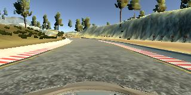
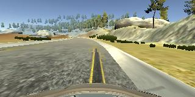
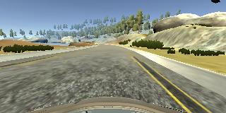
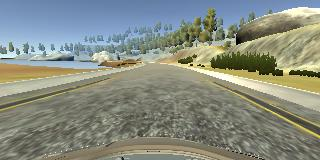

# Behavioral Cloning Project

In this project, deep neural networks and convolutional neural networks are used to clone driving behavior

The steps of this project are the following:
* Use the simulator to collect data of good driving behavior
* Build, a convolution neural network in Keras that predicts steering angles from images
* Train and validate the model with a training and validation set
* Test that the model successfully drives around track one without leaving the road
* Summarize the results with a written report

## Dependencies 

The project environment is created with [CarND Term1 Starter Kit](https://github.com/udacity/CarND-Term1-Starter-Kit).

The training dataset used can be downloaded [here](https://drive.google.com/file/d/1cfkh2W3NSLGCxoHOnGBu67-KbAnYx4pL/view?usp=sharing).

The training and testing phases are carried out with this [simulator](https://github.com/udacity/self-driving-car-sim)

The project includes the following files:
* model.py containing the script to create and train the model
* drive.py for driving the car in autonomous mode
* model.h5 containing a trained convolution neural network
* video.mp4 video showing off the results

## Model Architecture and Training Strategy

### 1. Creation of the Dataset
To capture good driving behavior, I started by recording two laps on track one using
center lane driving. Here is an example image of center lane driving:

  

In order to generate a bigger dataset, I acted in three different ways. 

First, I recorded one lap on track 1 in the opposite direction.

Then, I recorded one lap of the second track which is much more difficult in terms of
rounds and slopes.

Last, I flipped along the vertical axes all the images in the training set since the
model is trained mostly with data coming from a counterclockwise lap on a circuit.

This means that for most of the time the car is steering left. It results that the final
model predicts to steer left even when it is better to go straight. The image flipping
prevents this behavior.

Then, I recorded some vehicle recovering from the left side and right sides of the
road back to center so that the vehicle would learn how to act in case the car has to
face these situations.

These images show what a recovery looks like starting from the right side of the
road:

  
   
  

     

After the collection process, considering all the three camera and the data augmentation I had number of 109.998 images available which I considered enough for the project purpose.

### 2. Generating the dataset
Starting from the overall dataset, I randomly shuffle it and put 20% of the data into a validation set while the remaining 80% is used as training set.

Since the images are 160 x 320 x 3, storing all images at one time would be too memory consuming.

Instead of storing the preprocessed data in memory all at once, we use a generator that pull pieces of the data and process them on the fly only when you need them, which is much more memory-efficient.

For every batch, we extract the center, left and right images as well as the measurement images.

In case of left or right camera images, the steering angle measurements have to be edited by a correction factor, which in our case equals to 0.2.

### 3. Data preprocessing
Each image of the dataset is preprocessed before being used.

Firstly, the image is cropped 70 pixels from the top and 25 from the bottom so that the model does not consider meaningless part of the image such as the background. In addition, the RGB values of the image pixels are centered and normalized such that from a value ranging from [0, 255] to [-0.5, 0.5].

### 4. Model Architecture
After some experiment with the lenet architecture, I decided to use a more powerful architecture such as the NVIDIA architecture. It is made of five convolutional layers followed by four fully connected layers. In order to prevent overfitting, I added three dropout layers between the fully connected layers.

The validation set helped to determine if the model was over or under fitting.
Finally, I decided to stop the training at 3 epochs since with more iteration I noticed a performance worsening. The model is optimized using an Adam optimizer so that manually training the learning rate was not necessary.

### 5. Final results
During the simulation of the trained model in autonomous mode on the first track I had some issues in having a good performance.

In particular, I found difficult to keep the car on track on the curve right after the bridge.

After some experiment I found that the majority the data set have 0° steering angle.
This causes the model to tend to not steer even if there is a turn.
In order to counteract this behavior, I decided to randomly drop the 30% of the images which present 0° steering angle. In this way I balance the amount steering and straight images.

Once I solved this problem, the model worked fine when tested on track 1.
In fact, as visible in the video in this folder, the car is able to finish a whole lap always keeping the tires in the drivable portion of the road and without bumping or rolling over any surface.
